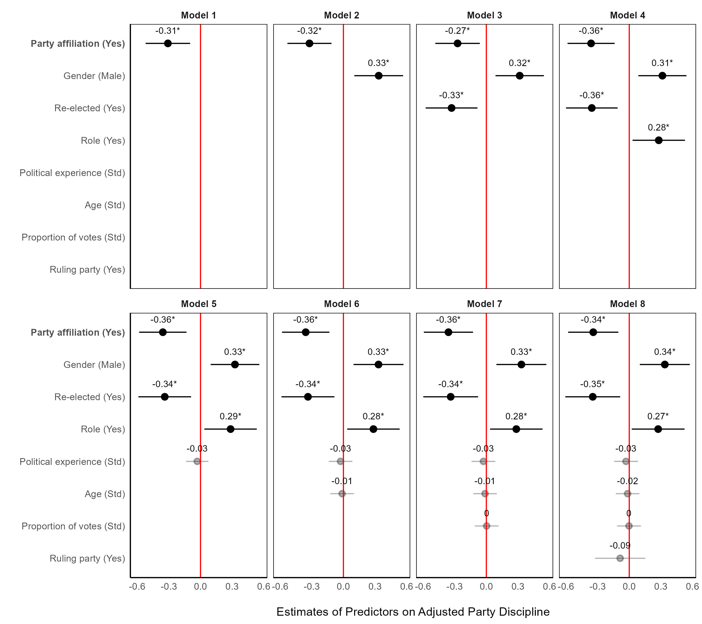

# Unravelling Party Discipline in the Global South: A Case Study of Peru Using Beta Regression Analysis

Welcome to the GitHub repository for the thesis titled "Unravelling Party Discipline in the Global South: A Case Study of Peru Using Beta Regression Analysis" by Cristhian Jaramillo, conducted as part of the MSc Social Research Methods program at the London School of Economics and Political Science.

## Research Overview

This repository houses all the materials utilized in the creation of the aforementioned thesis. The primary research question addressed in this study is: "Does party control, quantified through party affiliation (independent variable), positively correlate with party discipline (dependent variable) within the Peruvian context (2011 to 2019)?"

To test this hypothesis and shed light on the research question, the dissertation procures data from the official website of the [Peruvian Parliament](https://www.leyes.congreso.gob.pe) and the [Peruvian National Jury of Elections](https://infogob.jne.gob.pe). The study constructs a party discipline index, focusing exclusively on the voting behaviors of Members of Parliament (MPs) concerning motions of confidence, no confidence, and interpellations. The selection of these specific votes is grounded in their significance and potential impact on both the Parliament and the Executive Cabinet. Given that this index is constrained between 0 and 1, the study employs a **beta regression** to assess the hypothesis.

The predictors of this model encompass party control over its members and various control variables. Within the Peruvian context, the assessment of party control over MPs involves an examination of their affiliation status. Membership affiliation signifies an individual's adherence to the internal regulations stipulated by their party. Therefore, as theorized by scholars, the manifestation of party control can be discerned through the presence or absence of party affiliation. Control variables include Gender, Age, Proportion of Votes, Political Experience, Re-election status, Party Role, and Ruling Party affiliation. These variables were chosen based on their relevance to party discipline literature and their availability on the mentioned websites. The party discipline index was adjusted to prevent exact values of 1, facilitating beta regression, and continuous control variables were standardized.

## Raw Data

The `./Raw Data/` directory contains the original data extracted from confidence, no-confidence, and interpellation motions. Each file within this directory is a PDF documenting the voting behavior of the 130 MPs. It is important to note that each PDF is in Spanish, and the accompanying table provides a detailed descriptive overview of the data.

|           | Interpellations | Motion of Confidence | Motion of No Confidence | Total |
|---------------|:-------------:|:-------------:|:-------------:|:-------------:|
| 2011-2016 |       19        |          1           |            1            |  21   |
| 2016-2019 |        8        |          4           |            1            |  13   |
| Total     |       27        |          5           |            2            |  34   |

## Final Data

The `./Final Data/` directory comprises two files. The `./Final Data/party_discipline_index` contains comprehensive information on the voting behavior of each MP in the selected motions. Specifically, it includes the following variables:

-   `Surname 1`: The first surname of the MP.
-   `Surname 2`: The second surname of the MP.
-   `Names`: he full names of the MP.
-   `Political party`: The political party for which the MP was elected.
-   `Interpellations, motions of confidence, and motion of no confidence`: Records all votes cast by each MP. A value of 1 indicates a vote in accordance with the majority of the political party, while 0 represents a vote against the party majority. Each vote is associated with the political party of the respective MP.
-   `Number of times MP´s vote aligns with their party`: The sum of all disciplined votes, indicating the instances where the MP voted in line with their political party.
-   `Total of votes`: The total number of voting procedures in which the MP participated.
-   `Party discipline`: The individual party discipline index, calculated as the ratio of the number of times the MP's vote aligns with their party to the overall number of votes.

In the `./Final Data/` section, you'll encounter the `./Final Data/final_dataset` Excel file, which consists of four sheets: `2011_total`, `2016_total`, `FINAL`, and `FINAL_edited`. Here's a breakdown of each sheet:

**`2011_total` and `2016_total`:** These sheets provide detailed datasets for the legislative periods of 2011-2016 and 2016-2019, respectively. They include all the necessary variables for the analysis.

**`FINAL`:** This sheet consolidates both periods, focusing exclusively on originally elected MPs. It excludes individuals who occupied congressional seats due to resignations, deaths, or the inability to complete their tenure of other MPs.

**`FINAL_edited`:** The dataset used in this study is contained in this sheet. It includes only MPs who successfully completed their tenures and have sufficient information for the study. MPs who did not fulfill their tenure or joined in the later stages of legislative periods are omitted from this dataset.

These datasets encompass a range of variables providing comprehensive insights into the parliamentary landscape:

-   `year`: The respective year.
-   `Surname 1`: The first surname of the MP.
-   `Surname 2`: The second surname of the MP.
-   `Names`: he full names of the MP.
-   `party`: Political party for which the MP was elected.
-   `party_discipline`: Party discipline index, calculated in the **party_discipline_index** dataset.
-   `party_affiliation`: Party affiliation of each MP, where 1 signifies affiliation to the political party, and 0 indicates no affiliation.
-   `gender`: Gender of the MP.
-   `birth`: Date of birth of the MP.
-   `election_date`: Date of the election in which the MP was elected.
-   `age`: Age of the MP at the date of the election.
-   `pol_experience`: Political experience of each MP, measured by the number of elections in which the MP participated.
-   `role`: Role of the MP in the political party, with 1 denoting the presence of a role and 0 indicating otherwise.
-   `number_parties`: Number of political parties to which the MP was affiliated in the past.
-   `re_elected`: Indicates whether the MP was re-elected (1 for yes, 0 for no).
-   `votes`: Number of votes obtained by the MP.
-   `prop_votes`: Proportion of votes obtained by the MP, calculated by dividing their total votes by the overall votes obtained by their political party in their respective electoral district.
-   `rule`: Indicates whether the MP belongs to the ruling party (1 for yes, 0 for no).

## Code

The `./Code/` directory contains two separate scripts to replicate each analytical figure in the thesis. The `./Figures/` directory contains a copy of each of the figures generated by these scripts.

-   [analysis_descriptive_beta.R](https://github.com/cristhianjaramillo/dissertation_partydiscipline/blob/main/Code/analysis_descriptive_beta.R):  This R file is designed to generate a density plot, offering an evaluation of the distribution of the party discipline variable by party affiliation. It also provides a detailed representation of all beta regression models created and a thorough depiction of Model 8.

-   [evaluation.R](https://github.com/cristhianjaramillo/dissertation_partydiscipline/blob/main/Code/evaluation.R): This R file houses the model evaluation section, presenting AIC and BIC values. Additionally, it includes a detailed figure showcasing diagnostic plots for the beta regression model, covering residuals, normality, and homoscedasticity.

